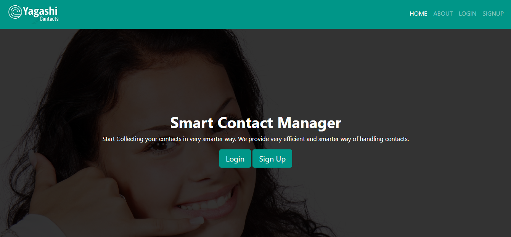
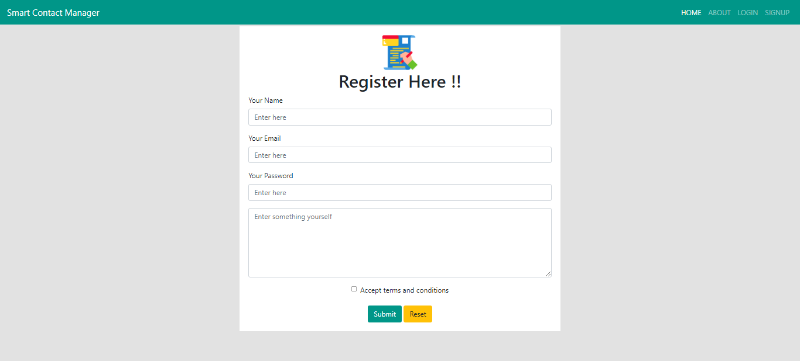
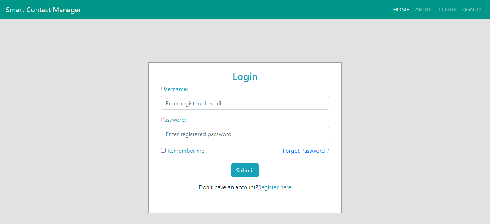
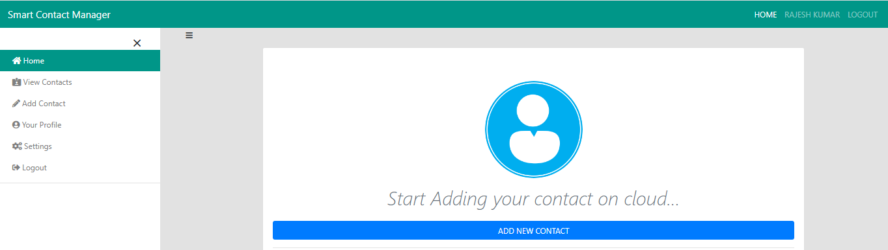
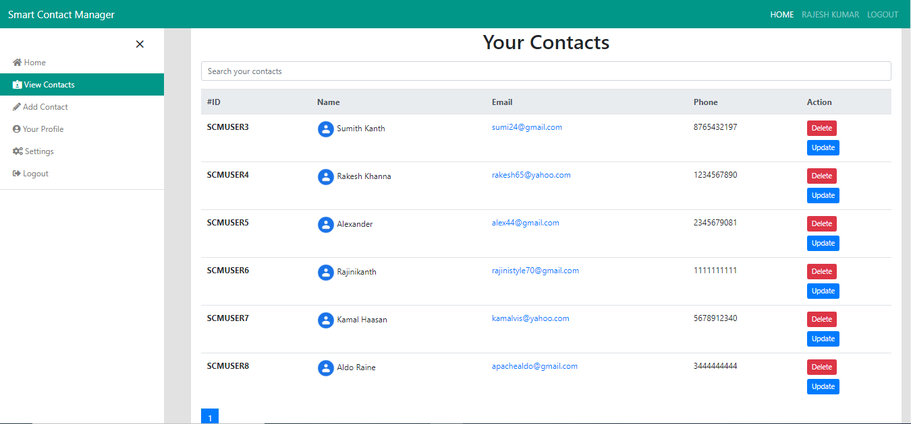
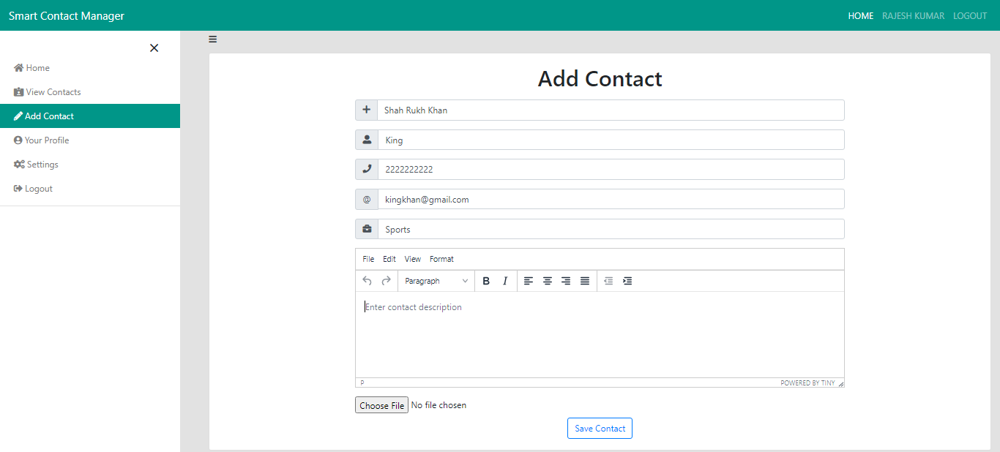
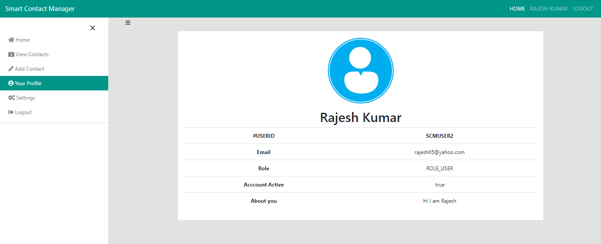
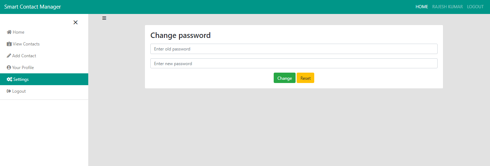
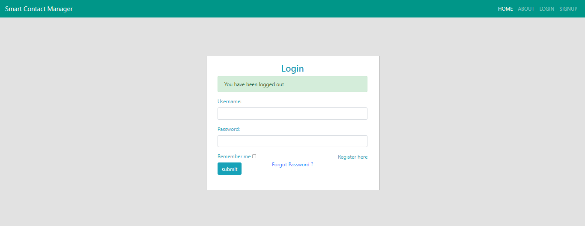

# yagashi-contacts

Yagashi Contacts is a smart contact manager that helps you to Create, Read, Update and Delete(CRUD operations) your contacts(in simple terms manage your contacts).

In order to use this contact manager, you must first create an account. If you are an already registered member, you can login to manage your contacts.

This contact manager is developed using the SpringBoot as web framework, MySQL as database, HTML/CSS/JS as frontend tools and Hibernate as ORM tool.

Before downloading the project, make sure that you have an IDE like STS, IntelliJ, Eclipse installed on your system(It's your choice). I have installed Eclipse IDE.
In order to download STS plugin in Eclipse: 
1. Click on Help option form the Eclipse Menu bar. A drop down list appears.
2. Select Market option from the dropdown list. A dialog box with a textfield to search appears.
3. Search for Spring Tools Suite by typing STS in the textfield. A curated list of STSs appears. 
4. Download the latest version of STS from that list and enjoy building SpringBoot applications.

Also make sure that MySQL is installed in your system.

## How to run the project?

1. Clone or download this repository to your local machine.
2. Open the project in the IDE. When the project opens the dependencies of the are automatically installed.
3. Open the application.properties file from `/src/main/resources/application.properties`.
4. In the application.properties file, the password of the database is given as `root`, i.e., in the 9th line `spring.datasource.password=root`. Replace the `root` with your default MySQL database's password.
5. In the 5th line of application.properties, the database URL is given `spring.datasource.url=jdbc:mysql://localhost:3306/smartcontact?serverTimezone=UTC`. Create a database called `smartcontact`(database name specified in the database URL) in MySQL.
6. Now, run the application as SpringBoot App and manage your contacts !!

## Screenshots

